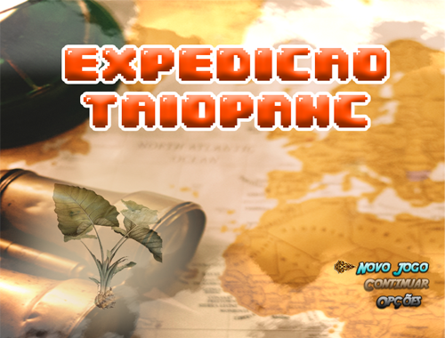
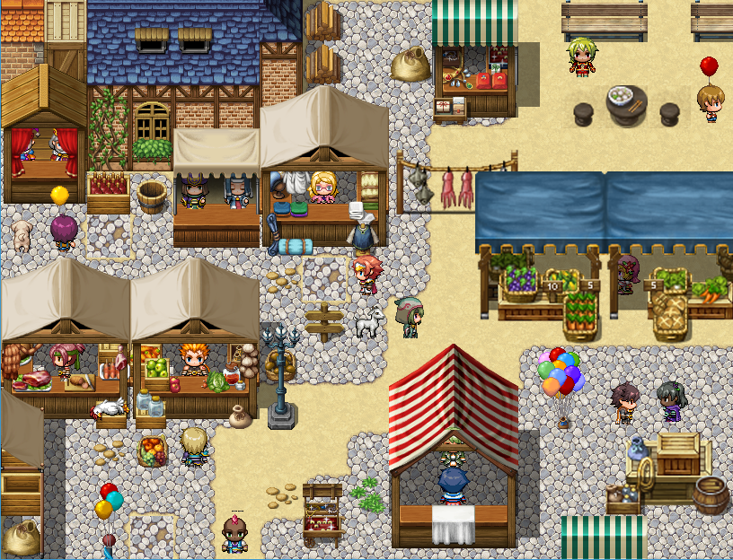

<h1 align="center">
  
</h1>

<h1 align="center">Expedição Taiopanc</h1>

Jogo educacional 2D de gênero aventura

<h4 align="center"> 
	🚧    Em construção...  🚧
</h4>

É visível nas práticas de ensino o impacto de tecnologias aplicadas e o interesse natural dos estudantes por jogos digitais. Com isso, na prática diária, em especial nos momentos de estudos remotos, precisamos superar a limitação do uso isolado dos textos já usualmente oferecidos para o trabalho com biodiversidade, alimentação saudável e outros aspectos da biologia no ensino médio. 

O jogo se apresenta como uma alternativa pertinente aos textos conteudistas e busca alcançar uma nova experiência de descorbetas, favorecendo reflexões e a criatividade em solucionar problemas. "Expedição TAIOPANC", uma referência ao nome da cidade Taiobeiras e a biodiversidade ali encontrada, descrita como parte da cultura local que pretende proporcionar uma exploração aos hábitos esquecidos e usuais.

O enredo do jogo se passa na cidade fictícia "Taiô", que possui diversas referências à antiga Taiobeiras, local onde a taioba, uma das PANC tratadas cresce de forma nativa. Estando o enredo dividido em três vertentes principais, em cada uma delas o jogador poderá atuar de forma diferente ao escolher entre uma das três propostas de atuação: Cultivador, Cozinheiro e Pesquisador. Cada uma dessas três propostas contará com variados desafios e problemas a serem solucionados pelos alunos durante a exploração.

<h1 align="center">
  
</h1>

# Features
- [x] Customização do personagem
- [X] Diferentes linhas de história
- [ ] Multiplayer
- [ ] Versão mobile

# Pré-requisitos

### Requisitos mínimos

-Sistema Operacional: WindowsR 7/8/8.1/10 (32bit/64bit);
-Processador: Intel Core2 Duo ou superior;
-Memória: 2 GB RAM;
-Placa de Vídeo: DirectX 9/OpenGL 4.1 capable GPU;
-Espaço em Dísco: 1 GB.

### Notas Adidionais:
-Resolução de tela de 1280x768 ou superior.

### Requisitos Recomendados
Placa de Vídeo: OpenGL ES 2.0 (AMD Catalyst 10.9, nVidia 358.50), iOS 8.0, Android 4.4.4*

